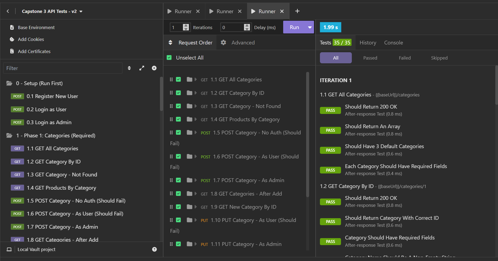
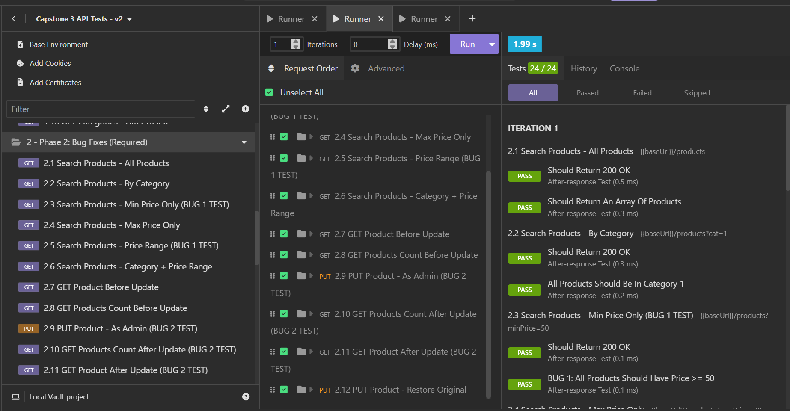
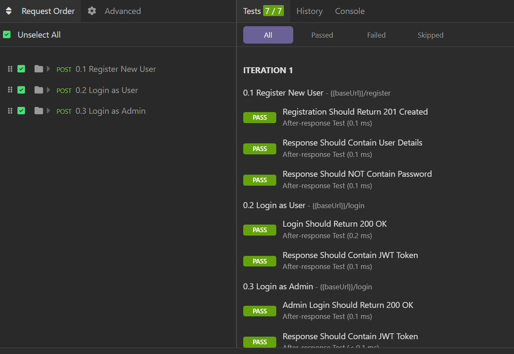
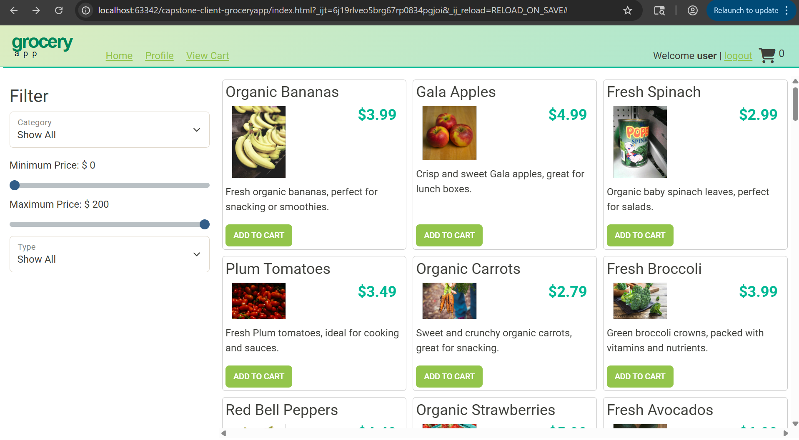

# Grocery App

## Description of the Project

This project is a Spring Boot–based backend API for a Grocery e-commerce web application. It represents Version 2 of an existing online store and was completed as a capstone project with a focus on backend development, debugging, and feature enhancement.

The application supports common e-commerce functionality such as product browsing, searching, filtering, and user authentication. All development work is performed on the Java Spring Boot API, which connects to a MySQL database. A front-end web application is provided to demonstrate and test the API, but no front-end development is required.

## User Stories

- As a shopper, I want to view all grocery categories, so that I can easily browse products by category.
- As a shopper, I want to view details for a single category, so that I can view what products it contains.
- As an administrator, I want to add a new grocery category, so that new product types can be organized properly.
- As an administrator, I want to update an existing category, so that I can correct or improve category information.
- As an administrator, I want to delete a category, so that outdated or unused categories can be removed.
- As a shopper, I want the product search and filter functionality to return accurate results, so that I can easily find grocery items that match my selected criteria.
- As an administrator, I want updating a product to modify the existing record instead of creating duplicates, so that product information remains accurate and consistent. 

## Setup

Instructions on how to set up and run the project using IntelliJ IDEA.

### Prerequisites

- IntelliJ IDEA: Ensure you have IntelliJ IDEA installed, which you can download from [here](https://www.jetbrains.com/idea/download/).
- Java SDK: Make sure Java SDK is installed and configured in IntelliJ.

### Running the Application in IntelliJ

Follow these steps to get your application running within IntelliJ IDEA:

1. Open IntelliJ IDEA.
2. Select "Open" and navigate to the directory where you cloned or downloaded the project.
3. After the project opens, wait for IntelliJ to index the files and set up the project.
4. Find the main class with the `public static void main(String[] args)` method.
5. Right-click on the file and select 'Run 'EasyshopApplication.main()'' to start the application.

## Technologies Used

- Java: JDK corretto-17 Amazon Corretto 17.0.16
  Build system: Maven
- IntelliJ IDEA 2025.2.1 (Community Edition)
- Springboot 4.0 model Version, maven
- 
## Demo

Include screenshots or GIFs that show your application in action. Use tools like [Giphy Capture](https://giphy.com/apps/giphycapture) to record a GIF of your application.

## Future Work

Outline potential future enhancements or functionalities you might consider adding:

- change web UI
- Add Test
- complete shopping cart feature 
- add User Profile feature
- add Checkout feature
- refactoring 

## Resources

List resources such as tutorials, articles, or documentation that helped you during the project.

AI Tools Used for Project Assets:
- [chatgpt](https://chatgpt.com/), used for front end (client) topic search 
- [http statues](https://http.cat/)

## Team Members
Qi Qing Lin

## Thanks

Express gratitude towards those who provided help, guidance, or resources:

- Thank you to Raymon Maroun for continuous support and guidance.
- A special thanks to all peers for their help along the way.
